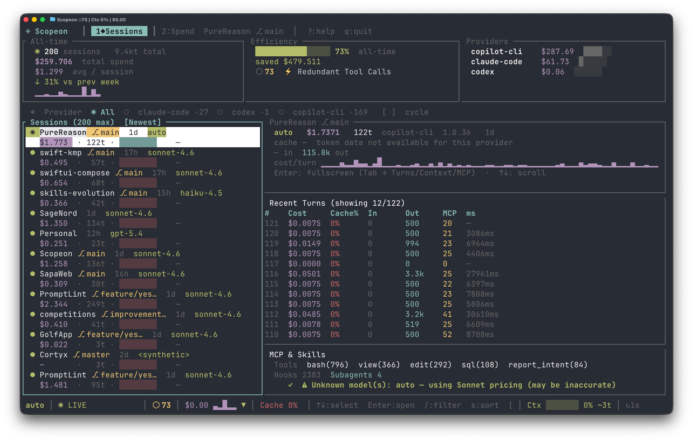
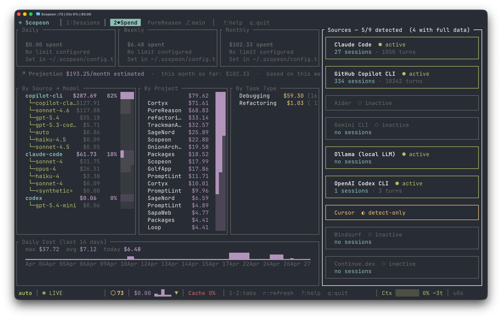

<div align="center">

<pre align="center">
◈  ╔═╗╔═╗╔═╗╔═╗╔═╗╔═╗╔╗╔
   ╚═╗║  ║ ║╠═╝║╣ ║ ║║║║
   ╚═╝╚═╝╚═╝╩  ╚═╝╚═╝╝╚╝
   AI Context Observability
   for Claude Code & friends
</pre>

**The AI context observatory — for every coding agent, every token, every dollar.**



[](https://github.com/sorunokoe/Scopeon/actions/workflows/ci.yml)
[](https://github.com/sorunokoe/Scopeon/releases)
[](docs/licenses/LICENSE-MIT)
[](https://blog.rust-lang.org/2025/05/15/Rust-1.88.0.html)

[**Install**](#installation) · [**Quick Start**](#quick-start) · [**Docs**](docs/) · [**Contributing**](#contributing)

</div>

---

*You fire up Claude Code and start building. An hour later: **"Context window full."** You have no idea what burned it — was it the MCP tools? The thinking budget? Yesterday's file edits? You're flying blind on a meter that costs real money.*

**Scopeon gives you the instrument panel.**

---

## Why Scopeon?

| Without Scopeon | With Scopeon |
|---|---|
| "Why is this session so expensive?" | Turn-by-turn cost breakdown with waste signals |
| "Is the prompt cache actually working?" | Hit-rate gauge, USD saved, optimization suggestions |
| "How close am I to the context limit?" | Real-time fill bar + *"~12 turns remaining"* prediction |
| "Which project costs the most?" | Per-project / per-branch cost breakdown |
| "What did the agent actually call?" | MCP & Skills tree — every server, tool, hook, skill with counts |
| "Is my context pressure growing over time?" | Context/Activity timeline sparkline per turn in session detail |
| "How does cost trend week over week?" | 14-day trend chart toggled with `t` — cost · sessions · cache rate |
| "Did my optimization actually help?" | `compare_sessions` before/after diff |
| "Can I gate AI cost in CI?" | `scopeon ci report --fail-on-cost-delta 50` |
| "How is my whole team using AI?" | `scopeon team` — per-author cost from git history, no server needed |
| "Can teammates see my live metrics?" | `scopeon serve` — privacy-filtered API + SSE stream for IDEs |
| "Can I see AI cost in Grafana / Datadog?" | Prometheus bridge or OTLP push — [docs/opentelemetry.md](docs/opentelemetry.md) |

---

## What you get

🔬 **X-ray vision into every token** — see exactly what burned your context: input, cache reads/writes, thinking budget, output, MCP calls — broken down turn by turn. No more guessing.

💸 **Know your real cost before the bill arrives** — live USD per turn, per session, per project, per day. Set budgets with actual alerts, not surprises.

⚡ **Prompt cache that *actually* tells you if it's working** — hit-rate gauge, dollars saved vs. uncached baseline. Know in seconds whether your cache setup is doing anything.

⏳ **"You have ~12 turns left"** — Scopeon tracks context fill rate over time and tells you how many turns remain before the wall. Stop being blindsided mid-task.

🔔 **Context advisory before the crisis** — compaction advisory fires at 55–79% fill when context is accelerating, so you compact at the optimal moment — not after it's too late.

📊 **Charts that make sense instantly** — `t` toggles a 14-day trend chart (cost · sessions · cache rate) directly inside the Sessions view. Per-turn cost sparklines live right in the session preview. No separate screens.

🔍 **Split-panel master-detail** — scroll sessions on the left, live detail on the right. Press Enter for full-screen. Three tab sections (`[` `]` to cycle): **Turns** table · **Context/Activity** timeline · **MCP & Skills** tree.

🧠 **Context Viewer** — for token-rich sessions: context fill % sparkline, peak usage, compaction events, prompt-cache reuse tip. For Copilot CLI: Activity Timeline showing output tokens, response time, and tool-call density per turn — real data in every case.

🔌 **MCP & Skills tree** — every MCP server, every tool call, every hook, every skill used in the session — vertical tree layout with call counts, fully scrollable.

📡 **Zero-token ambient awareness** — every 30 s the MCP server pushes a free status heartbeat to the agent. No polling, no token spend, just continuous situational awareness.

🧭 **See what the agent actually did** — provenance-aware history shows which skills, MCPs, hooks, tasks, and subagents were involved, with exact vs. estimated support called out per provider.

🤖 **Your AI agent monitors itself** — 17 MCP tools let Claude Code query its own token stats, provenance history, trigger alerts, and compare sessions — without you doing anything.

🚦 **Fail PRs on AI cost spikes** — one command in CI, zero config. `scopeon ci report --fail-on-cost-delta 50` catches runaway cost before it merges.

🌐 **Live browser dashboard + IDE stream** — `scopeon serve` → WebSocket-powered charts at `localhost:7771` and a `GET /sse/v1/status` SSE feed for IDE extensions. No npm, no Node, just Rust.

👥 **Team cost from git history** — `scopeon team` reads `AI-Cost:` trailers from `git log` and prints a per-author cost table. No server, no cloud, works from any machine.

🐚 **Cost follows you everywhere** — in your shell prompt, in every `git commit` as an `AI-Cost:` trailer, in Slack via digest webhooks.

🔒 **Fully local, forever** — no cloud backend, no account, no telemetry. Your prompts never leave the machine. Ever.

→ **[Full feature list](docs/features.md)**

---

## Screenshots

**Sessions** — split-panel master-detail with session list, live cost sparkline, and per-turn breakdown


**Spend** — daily/weekly/monthly spend by model, by project, 14-day trend chart



---

## Installation

### Fastest: `cargo binstall` (pre-built binary, no compilation)

```bash
cargo install cargo-binstall   # one-time
cargo binstall --git https://github.com/sorunokoe/Scopeon scopeon
```

### curl one-liner (macOS & Linux)

```bash
curl -fsSL https://raw.githubusercontent.com/sorunokoe/Scopeon/main/install.sh | sh
```

### From source

```bash
cargo install --git https://github.com/sorunokoe/Scopeon
```

**Requirements:** Rust 1.88+ · macOS 12+ or Linux (glibc 2.31+) · Windows 10+

> **Note:** `cargo install scopeon` and `cargo binstall scopeon` (without `--git`) require
> the crate to be published on crates.io, which is coming soon.

### Pre-built binaries

Download from [GitHub Releases](https://github.com/sorunokoe/Scopeon/releases):

| Platform | Asset |
|---|---|
| macOS Apple Silicon | `scopeon-vX.Y.Z-aarch64-apple-darwin.tar.gz` |
| macOS Intel | `scopeon-vX.Y.Z-x86_64-apple-darwin.tar.gz` |
| Linux x86\_64 | `scopeon-vX.Y.Z-x86_64-unknown-linux-gnu.tar.gz` |
| Linux ARM64 | `scopeon-vX.Y.Z-aarch64-unknown-linux-gnu.tar.gz` |
| Windows x86\_64 | `scopeon-vX.Y.Z-x86_64-pc-windows-msvc.zip` |

---

## Quick Start

```bash
scopeon onboard    # auto-detect AI tools, configure MCP + shell integration
scopeon            # open the TUI dashboard
scopeon serve      # browser dashboard → http://localhost:7771
scopeon status     # quick inline stats, no TUI
scopeon doctor     # health diagnostics
```

### Connect to Claude Code (MCP)

```bash
scopeon init
# → writes MCP server config to ~/.claude/settings.json
# Claude Code now has 17 Scopeon tools + proactive push alerts
```

### All commands

```bash
scopeon [start]                # daemon + TUI (default)
scopeon tui                    # TUI only (no file watching)
scopeon mcp                    # MCP server over stdio
scopeon status                 # inline stats
scopeon serve [--port N] [--tier 0-3]

scopeon tag set <id> feature   # tag sessions for cost attribution
scopeon export --format csv --days 30
scopeon reprice                # recalculate costs after a price change

scopeon digest [--days N] [--post-to-slack <url>]
scopeon badge [--format markdown|url|html]
scopeon ci snapshot --output baseline.json
scopeon ci report  --baseline baseline.json [--fail-on-cost-delta 50]

scopeon shell-hook             # emit shell prompt hook (bash/zsh/fish)
scopeon git-hook install       # add AI-Cost trailer to commits
scopeon onboard                # interactive setup wizard
scopeon doctor                 # health diagnostics
```

---

## Documentation

| Topic | Link |
|---|---|
| Full feature list | [docs/features.md](docs/features.md) |
| TUI guide (tabs, shortcuts, Zen, Replay, filter) | [docs/tui.md](docs/tui.md) |
| MCP tools & push notifications | [docs/mcp.md](docs/mcp.md) |
| Webhook escalation | [docs/webhooks.md](docs/webhooks.md) |
| CI cost gate | [docs/ci.md](docs/ci.md) |
| Shell & git integration | [docs/shell-git.md](docs/shell-git.md) |
| Team mode & REST API | [docs/team.md](docs/team.md) |
| OpenTelemetry integration | [docs/opentelemetry.md](docs/opentelemetry.md) |
| Supported providers | [docs/providers.md](docs/providers.md) |
| Configuration reference | [docs/configuration.md](docs/configuration.md) |
| Architecture & codebase map | [docs/architecture.md](docs/architecture.md) |

---

## Supported Providers

Claude Code · GitHub Copilot CLI · Aider · Cursor · Gemini CLI · Ollama · Generic OpenAI

Scopeon discovers log files automatically — no config needed for standard install paths.
Adding a new provider takes ~50 lines of Rust. See [docs/providers.md](docs/providers.md).

---

## Data & Privacy

- **Local-first** — no cloud backend, no accounts, no API keys required
- Reads token *counts* and *costs* only — never prompt text or code
- `scopeon serve` is read-only and localhost-bound by default
- Webhooks are opt-in; payloads contain only metric data

---

## Contributing

Contributions are warmly welcomed — bug fixes, new providers, dashboard features.

```bash
git clone https://github.com/sorunokoe/Scopeon
cd Scopeon
make          # fmt-check + clippy + test (same as CI)
make install  # install to ~/.cargo/bin
```

- **[docs/contributing.md](docs/contributing.md)** — dev workflow, PR process, adding providers
- **[docs/architecture.md](docs/architecture.md)** — codebase map: crate roles, data flow, schema

Every PR must pass the full CI suite (fmt · clippy · tests on Linux/macOS/Windows · MSRV · docs).

---

## Changelog

See **[docs/changelog.md](docs/changelog.md)** for the full version history.

---

## License

Dual-licensed under **[MIT](docs/licenses/LICENSE-MIT) OR [Apache-2.0](docs/licenses/LICENSE-APACHE)** — use it however you like.

---

<div align="center">

Built with ❤️ in Rust · [Report a bug](https://github.com/sorunokoe/Scopeon/issues/new?template=bug_report.md) · [Request a feature](https://github.com/sorunokoe/Scopeon/issues/new?template=feature_request.md) · [Discussions](https://github.com/sorunokoe/Scopeon/discussions)

*If Scopeon saved you money or context headaches, consider giving it a ⭐*

</div>
